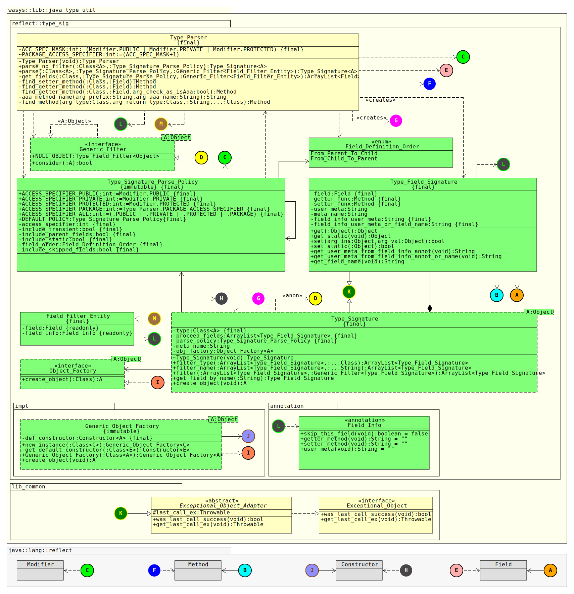

# WAsys_Java_type_util
Common type-level utils for Java  

## Revision History
Latest: v0.1.5 (Aug 22, 2020)  
Please refer to [release_note.md](./release_note.md) file  

## Requirements
* Java 1.5 or later

## Overview
This lib has module(s) about java type level funtionalities.  
Each modules would cover a specific requirements/functionalities.

## Installation
Artifacts could be grabed from central maven(or build by maven), and or ant.

**Maven** *(source/bin format: 1.5)*  
```xml
<dependency>
    <groupId>com.github.911992</groupId>
    <artifactId>WAsys_Java_type_util</artifactId>
    <version>0.1.5</version>
</dependency>
```
Or you would clone the repo, and build it as following:
```
mvn clean package
```
Artifact under `target` folder


**Ant** *(source/bin format: jdk 1.6)*  
Clone this repo, and build it by `ant` as following
```
ant clean jar
```
Artifact under `dist` folder

## Module::Type Signature
  
*Diagram 0: Type Signature Module Media Img*  

### Abstract
This module is about parsing and generate a siganture of a type. The signature would have list of fields signature that includes the `Field` ptr, and its setter/getter methods.

### Use Case
Serializing POJO were the main reason behind this. A requirement about auto data binding(read/write) like JDBC(thinking an ORM lib), or JSON.

### Class Diagram
  
*Diagram 1: Type Signature Module [Class Diagram](./_docs/_diagrams/class_diagram.svg)*  

### Sample Usage
Considering following sample usages. Since using this lib is pretty simple and straight forward, so having a dedicated repo may not be very logical.

#### Simple Field Setting(no setter method)
```java
class Entity0{
int model;
}
/*...*/
public static void main(String args[]) {
    //or Type_Signature<Entity0> _ts0=...
    Type_Signature _ts0=Type_Parser.parse_no_filter(Entity0.class, Type_Signature_Parse_Policy.DEFAULT_POLICY);
    Entity0 _e0=new Entity0();
    Type_Field_Signature _fage= _ts0.get_field_by_name("model");
    _fage.set(_e0, 911);
    System.out.printf("Model: %d\n",_e0.model);//911
}
```

#### Simple Field Setting(using setter method)
```java
package java_type_util_test;
class Entity1{
public String name;
    public String getName() {
        return name;
    }
    public void setName(String arg_name) {
        System.out.printf("Setting name to:%s\n",arg_name);
        this.name = arg_name;
    }
}
/*...*/
public static void main(String args[]) {
    //or Type_Signature<?> _ts0=...
    Type_Signature _ts0=Type_Parser.parse_no_filter(Class.forName("java_type_util_test.Entity1"), new Type_Signature_Parse_Policy(Type_Signature_Parse_Policy.ACCESS_SPECIFIER_ALL, false/*include transient*/, false/*include static*/));
    Type_Field_Signature _fname = _ts0.get_field_by_name("name");
    /*Going to create a new object by default constructor, since there is no Object_Factory has associated*/
    /*Using a Object_Factory is HIGHLY recomended over default constructor!*/
    Object _obj0=_ts0.create_object();
     _fname.set(_obj0, "Porsche");//will call the setName()
}
```

#### List Of Scrabed Fields
```java
class Entity2_P{
static String TYPE_VER;
String parent_name;
int parent_id;
}
class Entity2_C extends Entity2_P{
String child_name;
int child_id;
}
/*...*/
public static void main(String argsp[]) {
    //or Type_Signature<?> _ts =...
    Type_Signature<Entity2_C> _ts = Type_Parser.parse_no_filter(Entity2_C.class, new Type_Signature_Parse_Policy(Type_Signature_Parse_Policy.ACCESS_SPECIFIER_ALL, false/*excluding transient fields*/, true/*including static fields*/, Field_Definition_Order.From_Parent_To_Child/*scrap parent fields too*/));
    for(Type_Field_Signature _tfs : _ts.getProceed_fields()){
        System.out.printf("Field name:%s\n",_tfs.getField().getName());
    }
    /*out:
    Field name:TYPE_VER
    Field name:parent_name
    Field name:parent_id
    Field name:child_name
    Field name:child_id
    */
}
```

#### Using `Generic_Object_Factory` 
```java
class Plain_POJO3{
    public void hi(){
        System.out.println("Hello! Nothing especial here...");
    }
    public Plain_POJO3() {
        System.out.println("Instancing...");
    }
}
 /*...*/
 public static void main(String[] args) {
    try {
        //or Generic_Object_Factory<Plain_POJO3> _entity_factory = Generic_Object_Factory.new_instance(Plain_POJO3.class);
        Generic_Object_Factory<Plain_POJO3> _entity_factory = new Generic_Object_Factory<>(Plain_POJO3.class);
        Plain_POJO3 _smp = _entity_factory.create_Object();//"Instancing..."
        _smp.hi();//"Hello! Nothing especial here..."
    } catch (Exception wth) {
        wth.printStackTrace();
    }   
}
```